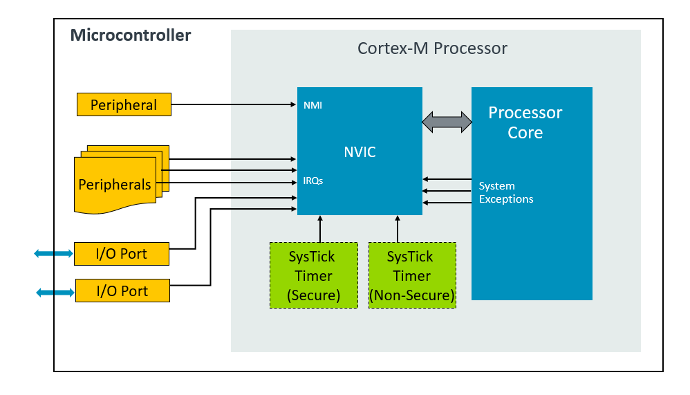

# ARM Cortex-M Vector Table

# Interrupts (Hardware Interrupts)

**Interrupts** are events typically generated by hardware, for example external peripherals or external pins, that cause changes in program flow control outside of the normal, programmed sequence.

When hardware or a peripheral needs service from the processor, the following sequence of events typically occur:

* The peripheral asserts an interrupt request to the processor.
* The processor suspends the currently executing task.
* The processor executes the Interrupt Service Routine (ISR) to service the peripheral.
* Once the ISR is complete, the processor resumes the suspended task.

Cortex-M processors provide a Nested Vectored Interrupt Controller (NVIC) for interrupt handling.

# Exceptions (Software Interrupts)

In addition to interrupts, there are other events that need servicing. These are called **exceptions**. In Arm terminology, an interrupt is a specific type of exception. Other exceptions in Cortex-M processors include:

* Faults
* System exceptions to support OS operations, including SVC, SysTick, and PendSV.

